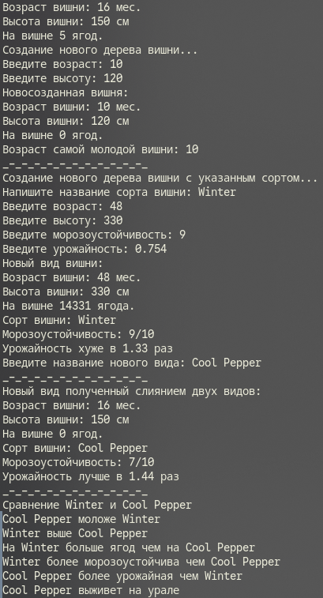
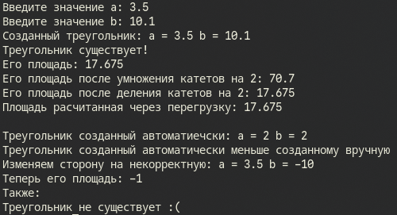

# Сурков Яков КМБ-1 Лабароторная №6

# Задание 1. ООП
## Задача 4
### Текст задачи
Разработать класс с тремя целочисленными полями. Создать конструктор копирования. Разработать метод, вычисляющий минимальное из полей. Перегрузить метод ToString() для формирования строки из полей класса. Реализовать дочерний класс (его содержание предложить самостоятельно и описать в решении: какой содержательный смысл имеют поля; реализовать конструкторы; предложить и реализовать 2-3 метода). Протестировать все конструкторы и другие методы базового и дочернего классов.

### Описание логики программы
В программе изначально создается объект из класса вишни в базовом случае. Затем у пользователя запрашиваются данные для создания нового объекта, также все входные данные проверяются на корректность. После выводится минимальное значение поля "возраст"(сравнение между первым и вторым объектом).
Во второй "части" сначала создается новый объект из дочернего класса от класса "вишня". Также значения полей запрашиваются у пользователя и они проверяются на корректность. Затем создается еще один объект такого же класса с базовыми значениями полей. После создается третий объект из этого класса, который образуется слиянием двух предыдущих объектов, от пользователя запрашивается только одно значение для поля "имя сорта". Далее полученный вид сравнивается по всем характеристикам с первым объектом из данного класса. Результат сравнения выводится на экран. Также выводится на экран выживет ли данный новый вид на урале (производится сравнение по полю "морозоустойчивость").
### Тестирование

# Задание 2 и 3. Перегрузка операций
## Задача 4
### Текст задачи
Создать класс RightTriangle с полями "double a, double b"(длины катетов) 
и следующими методами:
- Вычисление площади прямоугольного треугольника
- Унарные операции:
  - `++` увеличивает стороны треугольника в 2 раза
  - `--` уменьшает стороны треугольника в 2 раза
- Операции приведения типа:
  - `double` (явная) – результатом является площадь треугольника, если треугольник существует и отрицательное число в противном случае;
  - `bool` (неявная) – результатом является true, если треугольник с такими длинами сторон существует и falseв противном случае.
- Бинарные операции:
  - `<=` Trianglet1, Trianglet2 – сравнивает площади треугольников;
  - `>=` Trianglet1, Trianglet2 - сравнивает площади треугольников.
### Описание логики программы
Для начала создается "Треугольник1 и у пользователя запрашиваются значения полей. После чего выводится сообщение существует ли треугольник. Далее выводится его площадь. Затем оба катета треугольника увеличиваются в два раза и снова выводится его площадь. Затем стороны обратно уменьшаются вдвое и выводится площадь.
Далее создается треугольник по базовому случаю и его площадь сравнивается с первым треугольником. И выводится сообщение об итоге сравнения.
После создается ситуация в которой один из катетов отрицательный, для демонстрации функционала программы. Выводится площадь заведомо несуществующего треугольника, и выводится сообщение о том, что он не существует.

### Тестирование

